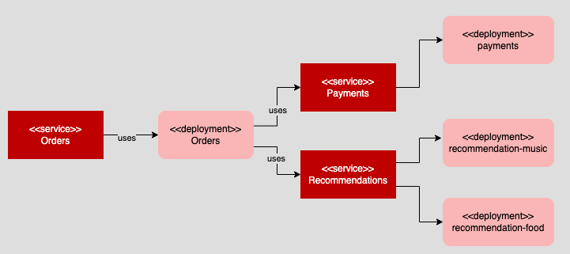

# Setting up the Openshift cluster using yaml configuration files.

This folder has the configuration files you need create the demonstration API that will be run under an OpenShift service mesh.

The services and deployments that make up the demonstration API architecture are shown in the figure below.

There is a shell script in this folder named `sh ./app-setup.sh` that will install all the components required including the API's K8S namespace `service-mesh-demo`.

Run the shell script in a terminal window within an OpenShift cluster in which you have adminstrator persmissions.

